# Our Rails Project

## A link (URL) to your published App:

Here is a link to our app: https://sheltered-ridge-97373.herokuapp.com/
____________________________________________________________________________

## A link to your GitHub repository:
Here is a link to our repo: https://github.com/raeginez/railsproject
____________________________________________________________________________

## A Description of our project:


### Problem definition / purpose
The purpose of this app is to sell your used shoes. You can also buy other peoples used shoes. This can help declutter your closet space and buy shoes at discounted prices.

### Functionality / features
Our app allows a user to create an item to sell. It includes:
- A Category
- A Title
- A Description
- A Price
- An Image
- Users are also able to edit and delete their listings.

It also allows a user to purchase other user's shoes. You can find shoes by one of the following categories:
- Boots
- Flats
- Trainers
- Heels

### Screenshots
Here are screenshots of our app:

This is our Home page:

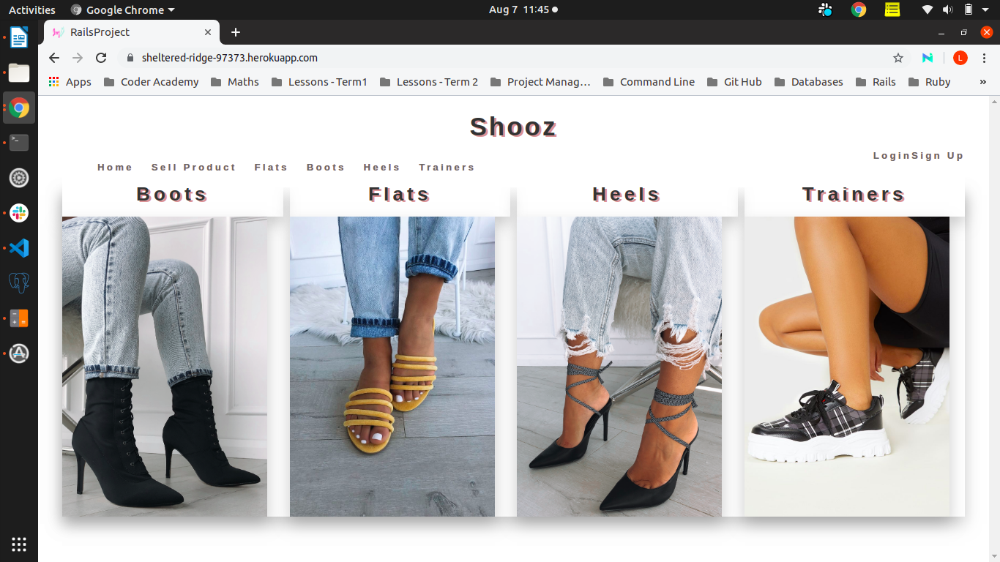

This is our Sign Up page:

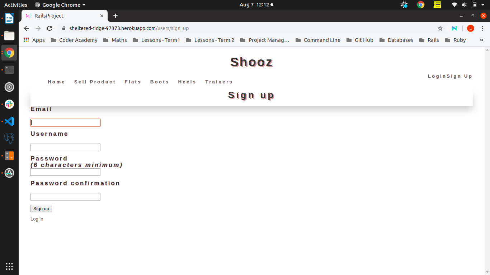

This is our Log In page:

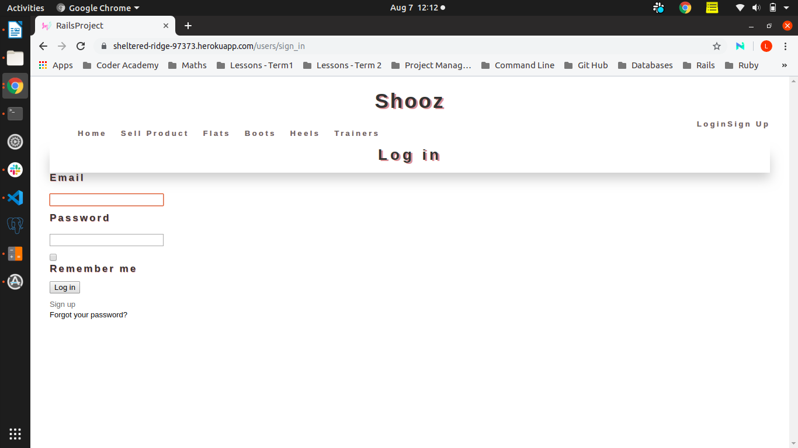

This is our Sell Product page:

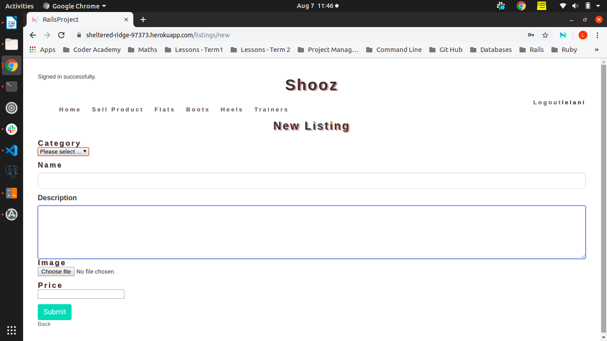

This is our Boots Category page:


This is our View Item page:

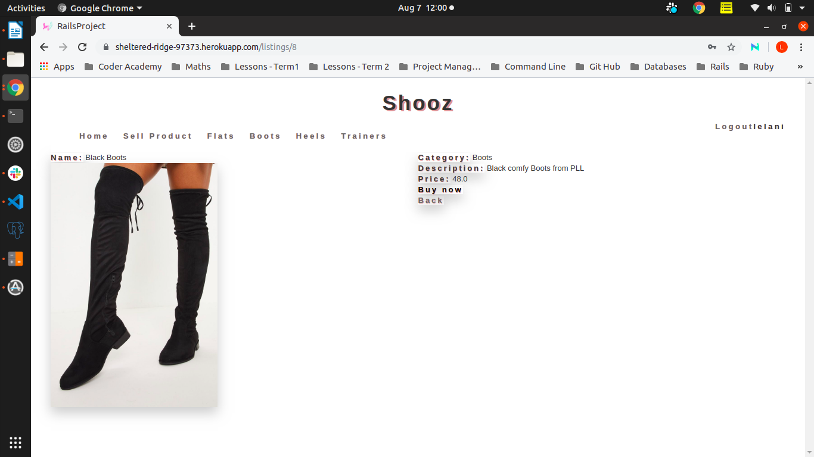

This is our Flats Category page:

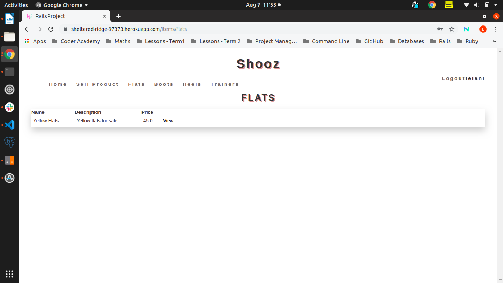

This is our Buy Now page:

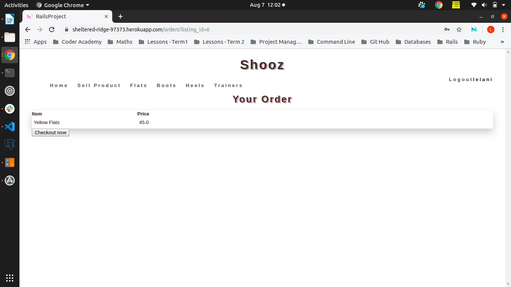

This is our Checkout page:

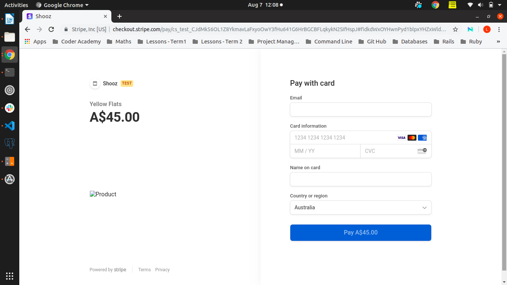

This is our Trainers Category page:

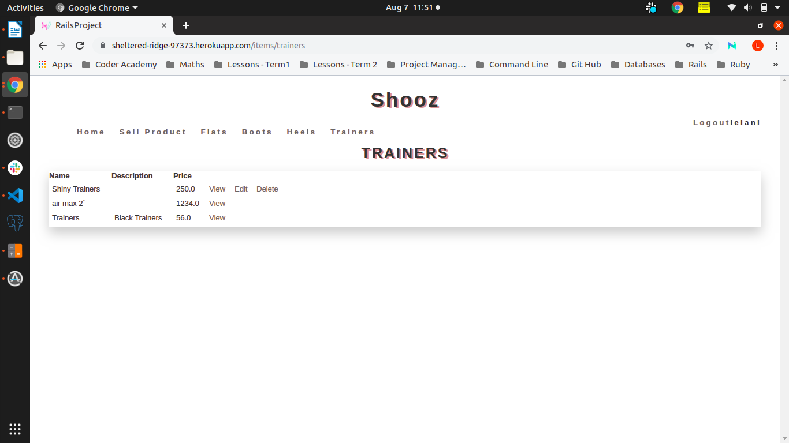

This is our Edit Item page:

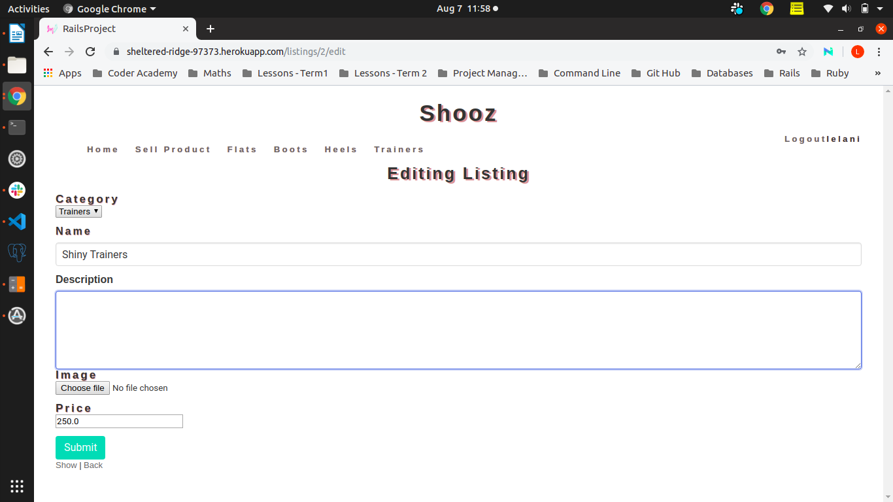

This is our Heels Category page:


This is our Delete Item page:


### Tech stack (e.g. html, css, deployment platform, etc)
Here is a list of the tech stacks we have used in our project:
- Ruby and .erb files
- Rails Framework
- HTML5
- CSS3
- Heroku
- Bulma
- PostgreSQL
- JS

Here is a list of the gems we have used in our project:
- Devise
- Stripe
- Cloudinary
- Rspec

### Instructions on how to setup, configure and use your App.

Here are the steps required to setup and configure our app prior to use:

1) Run bundle install (this will install all the required gems)
2) Update the database.yml file with your credentials
3) Run rails db:setup
4) Run rails db:migrate
5) Run rails s  (if you want to get the server started)
To use our app you simply require a browser and internet connection. Here are some common steps you can follow when using our app:

Here are the steps required to use our app:

- Sign Up to New Account:
  
  On every page, in the top-right of the navigation bar, you can find a link to sign-up to a new account. Simply click on the link and follow the online instructions to get you signed up. Email and password fields are compulsory. Password setup requires a minimum of 6 characters.

- Logging In or Out of your Account:
  
  On every page, in the top-right of the navigation bar, you can find a link to log in or out of your account. Simply click on the link and fill in your credentials to get you logged in. Click on the log out link to log out of your account.

- Adding a Username:

  When signing up to create a new account you have the option to create a username. This is an optional field.

- Searching for an Item:

  You can view items for sale by selecting their category. Simply clicking on the images on the home page or alternatively you can select the category links in the top navigation bar. (Future enhancement is to add a search function)

- Purchasing an Item:

  **Please note that you need to be logged in to purchase an item.**

  Once you have found an item you are interested in purchasing, simply click on the 'Buy Now' link. You will be redirected to 'Your Order' page where you can review your order. Once you are happy to proceed, click on the 'Checkout Now' button and you will be redirected to Stripe's online payment site. Fill in your payment details and once completed you will be redirected back to our homepage. (Future enhancements include having a cart where you can purchase multiple items and multiple quantities)

- Selling an Item:
  
  **Please note that you need to be logged in to sell an item.**

  To sell your item, simply go to the 'Sell Product' link found in the top navigation bar. Upon clicking this link you will be redirected to a 'New Listing' form. Here you are able to select your category, fill in your item name, description, price and upload an image. When you click on the Submit button you will be redirected to an overview of your listing. Item Category, Name and Price are compulsory fields.

- Editing or Deleting your Item:

  **Please note that you need to be logged in to edit or delete your items.**

  Once you are logged into your account you will have access links next to your items to edit and delete your listings.
____________________________________________________________________________
## Our Design documentation:

## Design process
These were the steps we took in our design process:

1) Decided the two-way marketplace we were going to create was for expensive used shoes
2) Came up with our project plan and timeline, breaking down important tasks and adding them to our Trello board
3) Came up with our user stories
4) Created our wireframes
5) Designed our ERD
6) Built our App
7) Completed our Documentation
8) Completed our Styling
____________________________________________________________________________

## User stories
Here is a list of our User Stories that we created on our Trello Board:

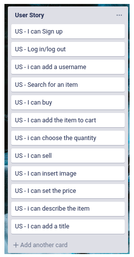

The following are future enhancements:
- Searching for an item with a search function
- A shopping cart where you can add multiple products
- A quantity field where you can purchase multiple quantities of the same product

____________________________________________________________________________

## A workflow diagram of the user journey/s.
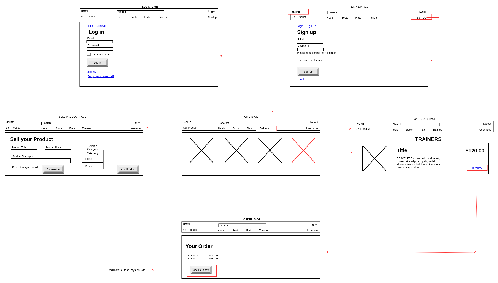

____________________________________________________________________________

## Wireframes
Here are our Wireframes:

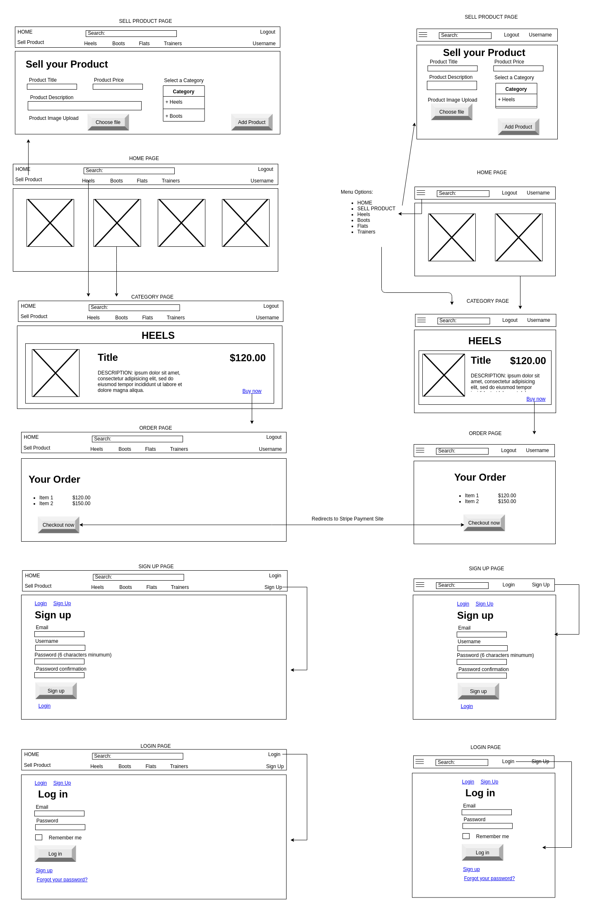
____________________________________________________________________________

## Database Entity Relationship Diagrams
Here is our ERD:

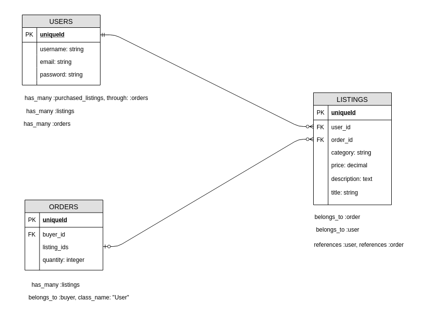

We do not have an orders model yet as this is a future enhancement once we have implemented our shopping cart
____________________________________________________________________________

## Details of planning process

## Project plan & timeline
Here is a screenshot of our project plan and timeline:

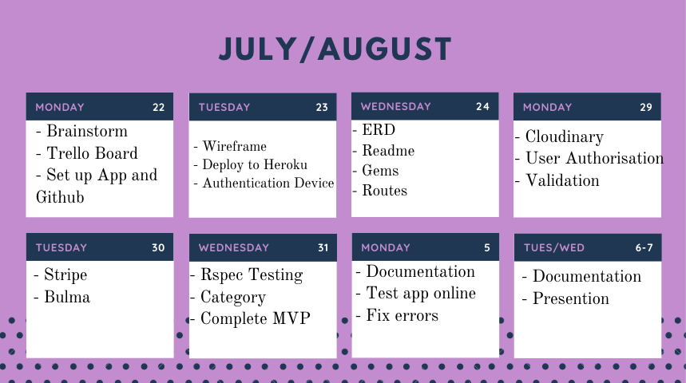
____________________________________________________________________________

## Screenshots of Trello board(s)
Here are screenshots of our Trello Board:

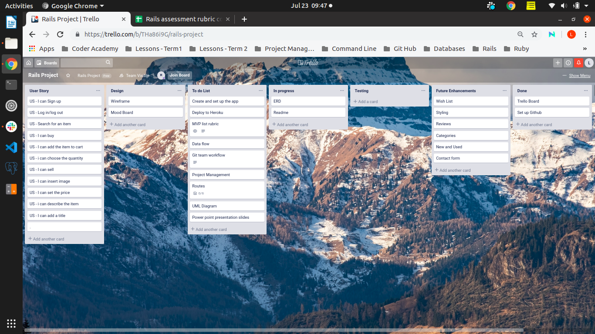

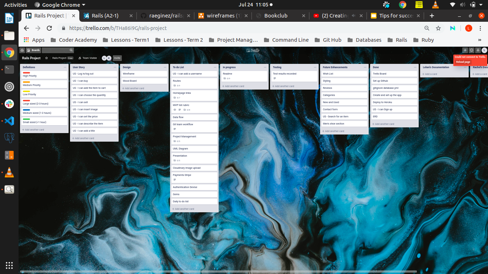

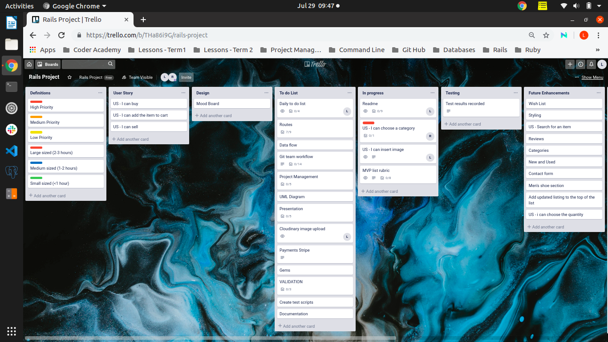

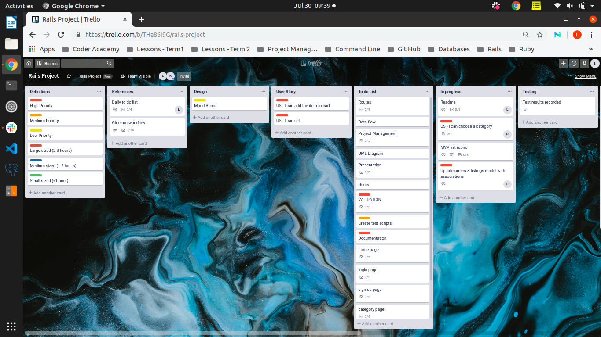

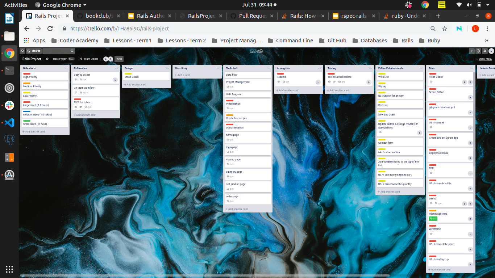


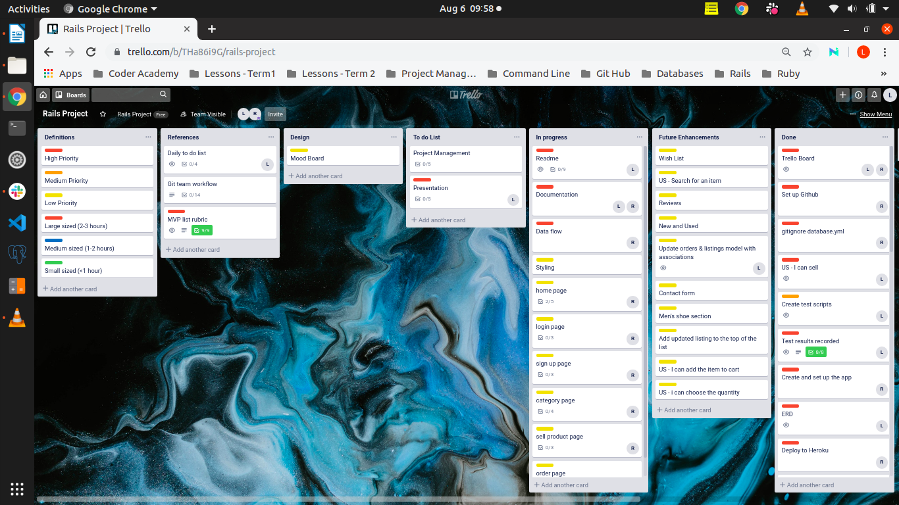


____________________________________________________________________________

## Screenshots of Slack Communication
Here are screenshots of our Slack Communication:

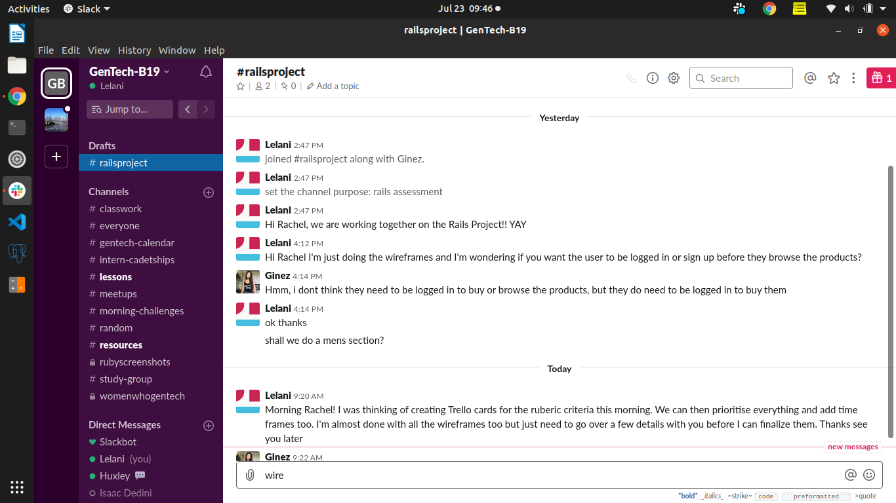

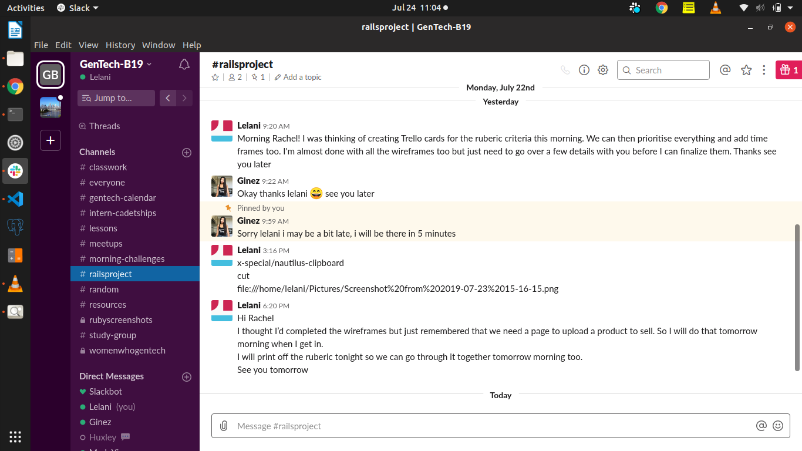

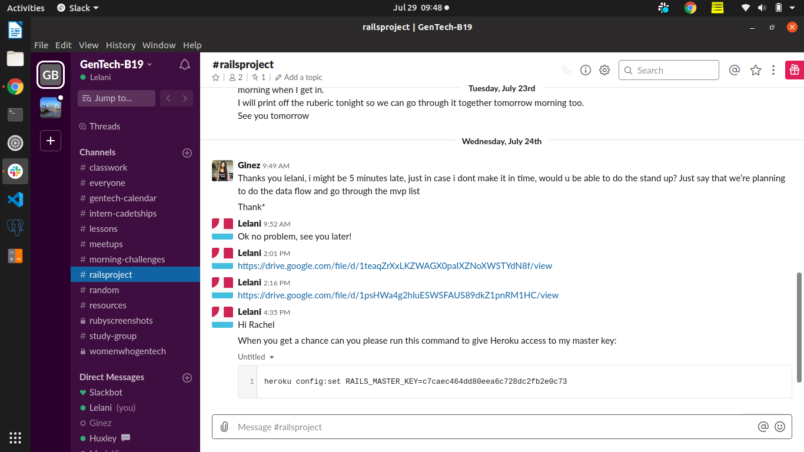

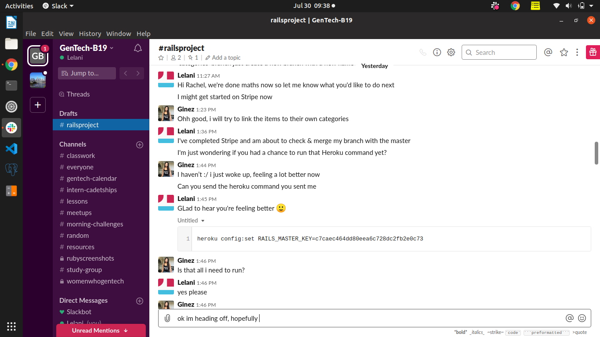

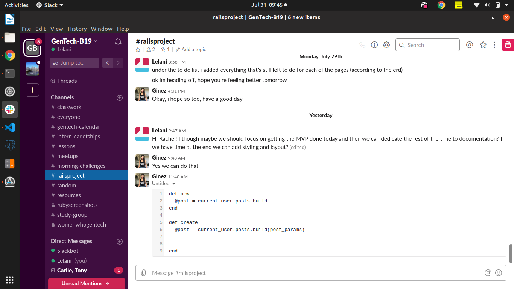

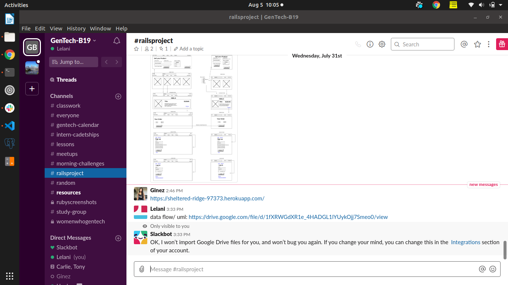

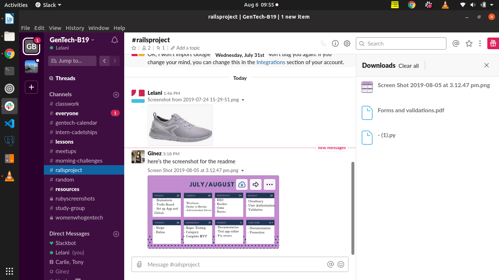

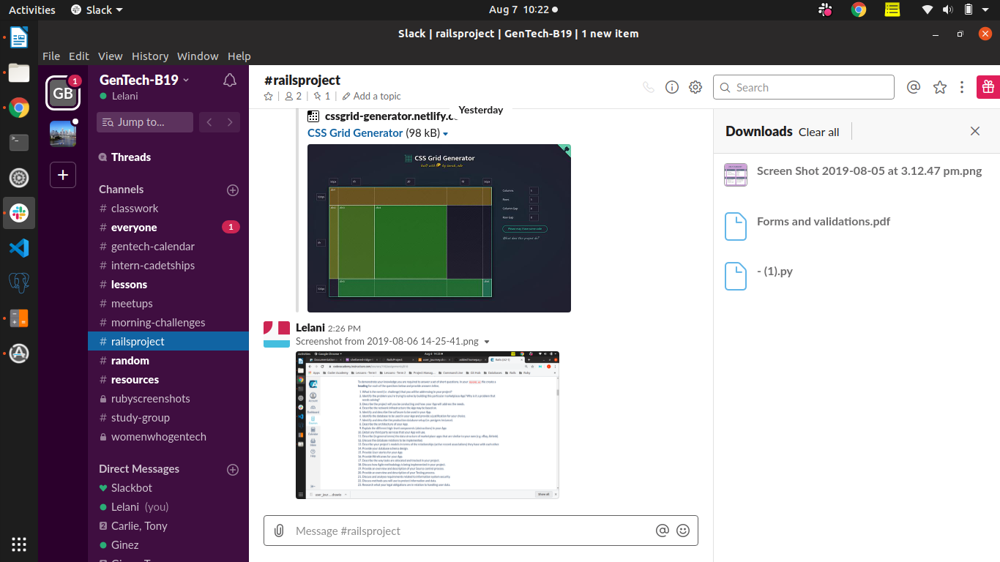
____________________________________________________________________________

## Answers to the Short Answer questions (Section 2.2)

### (1) What is the need (i.e. challenge) that you will be addressing in your project?

We have identified there is a need to buy and sell boutique used shoes in a convenient way online.

### (2) Identify the problem you’re trying to solve by building this particular marketplace App? Why is it a problem that needs solving?

We have identified that many women have expensive shoes in their closet that they no longer need or want. We thought a great way to clear out your closet and make some extra cash was to sell your used shoes online. 

### (3) Describe the project you will be conducting and how your App will address the needs.
An online store that allows a user to buy and sell boutique shoes at a reduced price in a easy manner. Users are able to add, edit and delete their listings. Users are able to find and purchase other people's listings.

### (4) Describe the network infrastructure the App may be based on.
We have used Heroku to deploy our app. 

Heroku's platform automatically routes the HTTP requests for our app's hostname from Heroku's domain. 

Once a connection has been established there is only a 30 second window for a response to be sent, else a H12 error will be logged.

Heroku routing offers simultaneous connections by supporting multiple co-current connections.

All info and error logs are stored in the Heroku router log format.

### (5) Identify and describe the software to be used in your App.

1) Ruby (and .erb files)
  
    We used Ruby and .erb files in our app

2) Rails Framework

    We used Rails as our app's framework

3) HTML5

    We used HTML5 in our markup

4) CSS3 & Bulma

    We used CSS3 and Bulma for our styling

5) Heroku

    We used Heroku for our online deployment

6) PostgreSQL

    We used PostgreSQL for our database

### (6) Identify the database to be used in your App and provide a justification for your choice.
We have used PostgreSQL for our app's database. 

We decided to use PostgreSQL as it is free and open source. It also has many features and is highly extensible. 

Another option we could have used was MySQL.

### (7) Identify and describe the production database setup (i.e. postgres instance).

As we deployed our app on Heroku's platform, we chose to use PostgreSQL for our production database. 

When setting up our database we had to add our credentials into our database.yml file.

### (8) Describe the architecture of your App.

Here is our UML:  


### (9) Explain the different high-level components (abstractions) in your App.

1) From the Homepage you can login/ out or sign up
  
2) From the Homepage you can upload a product to sell (Sell Product link). You must be logged in to upload an item. You will be redirected to the log in page if you are not logged in

3) From the Homepage you can search for products by category, either by clicking on the top navigation links or by clicking on the Homepage images
   
4) Once you have found an item you wish to purchase you can click on the Buy Now link. You must be logged in to purchase an item. You will be redirected to the log in page if you are not logged in.


### (10) Detail any third party services that your App will use.
1) Devise
  
    We used Devise for user login and sign-up authentication

2) Stripe

    We used Stripe for our secure online payment system

3) Cloudinary

    We used Cloudinary for user image upload

4) Rspec

    We used Rspec for our testing

5) Heroku

    We used Heroku for our online deployment

### (11) Describe (in general terms) the data structure of marketplace apps that are similar to your own (e.g. eBay, Airbnb).

A similar marketplace to our app is EBay. We have the following similarities:

- It is an online platform to buy and sell items (unlike EBay, we do not have an auction option)
- You must be signed in (or new users can register) to buy and sell items
- When adding a new item for sale, you fill out an online form (name, description, price, category, image)
- Items for sale are sorted by categories
- When purchasing an item, you are redirected to a secure online payment screen

### (12) Discuss the database relations to be implemented.

Here is our ERD:  


Our main database table is the Listings model. It has it's Primary key which identifies the item for sale. It also has a mandatory category from a drop down list (as a string). The Title (string), Price (decimal) and Image upload are also mandatory fields. The only optional field is the Description (text). Each item is linked to a User through a Foreign Key (see Users table).

Our next database table is the Users model. It has it's Primary key which identifies the user who is buying or selling an item. This is linked to the item being sold (as a Foreign Key). The Username (string), Email (String) and Password (string) are all mandatory fields.

At the moment we do not have an Orders model as this is a future enhancement once we've implemented a shopping cart option.


### (13) Describe your project’s models in terms of the relationships (active record associations) they have with each other.

- Each Item in our Listing model belongs to a user
- A User in our Users model can have many listings

Once we have implemented our future shopping cart we can add our Orders model with the following relationships:

- A User in our Users model can have many orders
- Each Item in our Listings model belongs to an order
- A User can have many Purchased Items through Orders
- An Order can have many Listings
- An Order belongs to a Buyer (with a class_name of User)


### (14) Provide your database schema design.
Here is our ERD:


We do not have an orders model yet as this is a future enhancement once we have implemented our shopping cart


### (15) Provide User stories for your App.
Here is a list of our User Stories that we created on our Trello Board:


____________________________________________________________________________

### (16) Provide Wireframes for your App.
Here are our Wireframes:


____________________________________________________________________________

### (17) Describe the way tasks are allocated and tracked in your project.
We broke up the major tasks with a project plan and timeline. We then created user stories and made sure we focused on completing our MVP first. Each morning we checked in with each other and decided which tasks each of us were going to complete for that day. We tracked our tasks and their priorities using our Trello Board. We also used Slack to communicate with each other.

### (18) Discuss how Agile methodology is being implemented in your project.
After our main app was setup and deployed to Heroku, we used the following steps to implement new functionalities:

1) Pull down master and create a new branch
2) Add new feature
3) Test the new feature works (using dummy text)
4) Push your branch up to GIT and merge with master 

### (19) Provide an overview and description of your Source control process.
Here are the steps we created and followed for using GitHub. (We added it into our Trello Board for easy reference too!):

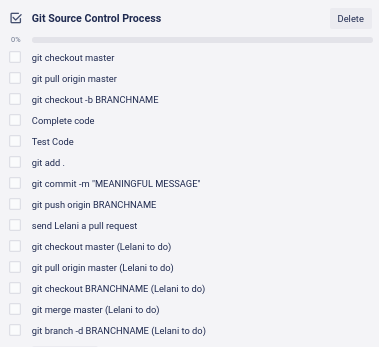
____________________________________________________________________________

### (20) Provide an overview and description of your Testing process.
We used manual testing after adding each new feature. We also used Rspec for our final testing. Here is the report of our test results:

```

===================================
Wed 31 Jul 14:15:50 AEST 2019
===================================


ListingsController
  GET #index
    returns a success response
  GET #show
    returns a success response
  GET #new
    returns a success response
  GET #edit
    returns a success response
  POST #create
    with valid params
      creates a new Listing
      redirects to the created listing
    with invalid params
      returns a success response (i.e. to display the 'new' template)
  PUT #update
    with valid params
      updates the requested listing
      redirects to the listing
    with invalid params
      returns a success response (i.e. to display the 'edit' template)
  DELETE #destroy
    destroys the requested listing
    redirects to the listings list

CategoriesHelper
  add some examples to (or delete) /home/lelani/projects/assessment3-rails-project/railsproject/spec/helpers/categories_helper_spec.rb (PENDING: Not yet implemented)

ListingsHelper
  add some examples to (or delete) /home/lelani/projects/assessment3-rails-project/railsproject/spec/helpers/listings_helper_spec.rb (PENDING: Not yet implemented)

Category
  add some examples to (or delete) /home/lelani/projects/assessment3-rails-project/railsproject/spec/models/category_spec.rb (PENDING: Not yet implemented)

Listing
  creates new questions with correct fields

User
  creates new questions with correct fields

Categories
  GET /categories
    works! (now write some real specs)

Listings
  GET /listings
    works! (now write some real specs)

CategoriesController
  routing
    routes to #index
    routes to #new
    routes to #show
    routes to #edit
    routes to #create
    routes to #update via PUT
    routes to #update via PATCH
    routes to #destroy

ListingsController
  routing
    routes to #index
    routes to #new
    routes to #show
    routes to #edit
    routes to #create
    routes to #update via PUT
    routes to #update via PATCH
    routes to #destroy

listings/edit
  renders the edit listing form

listings/index
  renders a list of listings

listings/new
  renders new listing form

listings/show
  renders attributes in <p>

Pending: (Failures listed here are expected and do not affect your suite's status)

  1) CategoriesHelper add some examples to (or delete) /home/lelani/projects/assessment3-rails-project/railsproject/spec/helpers/categories_helper_spec.rb
     # Not yet implemented
     # ./spec/helpers/categories_helper_spec.rb:14

  2) ListingsHelper add some examples to (or delete) /home/lelani/projects/assessment3-rails-project/railsproject/spec/helpers/listings_helper_spec.rb
     # Not yet implemented
     # ./spec/helpers/listings_helper_spec.rb:14

  3) Category add some examples to (or delete) /home/lelani/projects/assessment3-rails-project/railsproject/spec/models/category_spec.rb
     # Not yet implemented
     # ./spec/models/category_spec.rb:4

Finished in 1.8 seconds (files took 3.26 seconds to load)
39 examples, 0 failures, 3 pending

```
____________________________________________________________________________
### (21) Discuss and analyse requirements related to information system security.
At present we have the following security in place:

- A user can only edit and delete their own listings
- We have used Devise which authenticates users when they log in
- We have used Cloudinary which protects users image uploads
- We have used Stripe which provides a secure online payment platform for our users

### (22) Discuss methods you will use to protect information and data.
We used Devise, Cloudinary and Stripe in our app. They each have their own systems in place to protect our users information and data. 

### (23) Research what your legal obligations are in relation to handling user data.
We have a legal obligation to ensure that we protect our users information and personal data. 